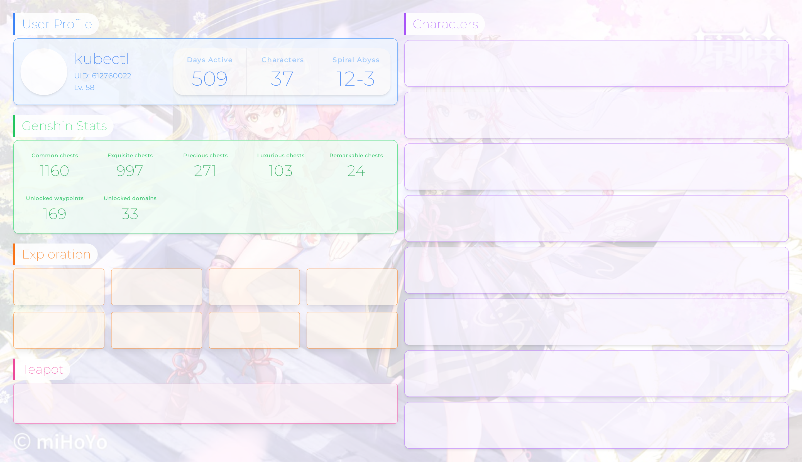

# Genshin Profile Card

[](https://github.com/Billyzou0741326/genshin-profile-card/actions/workflows/cypress.yml)




To support the following features, a few dependencies need to be installed:

- Puppeteer (headless browser)
- Chinese characters in generated card

```shell
# puppeteer
sudo apt-get install chromium-browser
# chinese characters (only for svg rendering)
sudo apt-get install fonts-wqy-zenhei
```


Node.js tech stack

- [`Next.js`](https://nextjs.org) - server side rendering, pages & api
- [`React.js`](https://reactjs.org) - frontend engine
- [`Tailwind css`](https://tailwindcss.com) - css util library
- [`Puppeteer`](https://github.com/puppeteer/puppeteer) - headless browser


## Getting Started

First, run the development server:

```bash
npm run dev
# or
yarn dev
```

Open [http://localhost:3000](http://localhost:3000) with your browser to see the result.

You can start editing the page by modifying `pages/index.tsx`. The page auto-updates as you edit the file.

The `pages/api` directory is mapped to `/api/*`. Files in this directory are treated as [API routes](https://nextjs.org/docs/api-routes/introduction) instead of React pages.

## Learn More

To learn more about Next.js, take a look at the following resources:

- [Next.js Documentation](https://nextjs.org/docs) - learn about Next.js features and API.
- [Learn Next.js](https://nextjs.org/learn) - an interactive Next.js tutorial.

You can check out [the Next.js GitHub repository](https://github.com/vercel/next.js/) - your feedback and contributions are welcome!

## Deploy on Vercel

The easiest way to deploy your Next.js app is to use the [Vercel Platform](https://vercel.com/new?utm_medium=default-template&filter=next.js&utm_source=create-next-app&utm_campaign=create-next-app-readme) from the creators of Next.js.

Check out our [Next.js deployment documentation](https://nextjs.org/docs/deployment) for more details.
